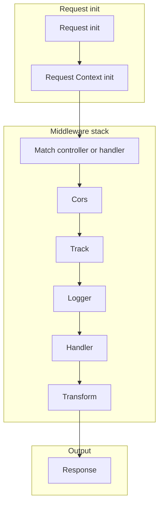

# Core Concepts

Morphis is easiest to understand if you read it as a middleware pipeline. The framework creates a request context, matches a route, then composes middleware around the final controller or handler.

That is not just a documentation abstraction. The core pieces in Morphis are literally implemented as middleware classes. `Middleware` is the shared base type, `Router.handle()` builds the chain, `runWithContext()` creates the request-scoped context, and decorators such as `@Controller()` and `@Transform()` are thin helpers over the same model.

## Request lifecycle

The actual flow in the source looks like this:



Use that diagram as the initial mental model, with one important detail: the exact order depends on how you register middleware in `router.use([...])` and which decorators you attach to the matched handler.

From the source code, the pipeline breaks down like this:

- Request init: `Router.handle()` receives the raw Web `Request` and parses path, params, query, and body.
- Request Context init: `runWithContext()` creates a fresh async-local `current` context for the request.
- `- Cors`: `CorsMiddleware` can short-circuit `OPTIONS` preflight and also applies CORS headers to the final response.
- `- Track`: `TrackMiddleware` creates `current.trackId` and adds `X-Track-Id` to the response.
- `- Logger`: `LoggerMiddleware` stores the resolved request path in context so console output is request-aware.
- `- Controller handler`: the matched route eventually reaches the controller method or inline route handler.
- `- Transform`: `TransformerMiddleware` can reshape request fields before the handler and the response after the handler.
- Output: non-`Response` values are normalized into `Response.json(...)`, then response middleware such as CORS can still adjust headers.

## Everything Is Middleware Under The Hood

Morphis keeps the public API simple, but internally the pieces are intentionally uniform.

- `Cors`, `Track`, and `Logger` are middleware instances or factories you can register in `routes/xxx.ts` with `router.use([...])`.
- `@Controller()`, `@Get()`, `@Post()`, `@Validate()`, `@Transform()`, and `@Connect()` are decorator-friendly wrappers around the same routing and middleware system.
- Because the router composes middleware around the matched route, you can mix global middleware and per-handler decorators without changing the programming model.

That is why Morphis feels plug-and-play in route setup. You are not switching between unrelated abstractions. You are assembling one middleware pipeline with a lighter syntax.

## Plug-And-Play Route Setup

The route file usually stays small and declarative:

```ts filename="src/routes/api.ts"
import { Cors, Logger, Router, Track } from 'morphis';
import { PostController } from '../controllers/PostController';

const router = new Router();

router.resources(new PostController());

router.use([
	Cors({ origins: '*' }),
	Track,
	Logger,
]);

export default router;
```

Then the controller focuses on route metadata and request-specific middleware:

```ts
import { Controller, Get, Request, Transform, Validate } from 'morphis';

@Controller('/posts')
export class PostController {
	@Get()
	@Validate({ query: PostListQueryValidator })
	@Transform({ res: PostListResponseTransformer })
	async list(req: Request) {
		return postService.list(req.query);
	}
}
```

This split is the main Morphis idea:

- route files wire the request pipeline
- decorators attach route-level behavior
- controllers stay thin
- services keep business logic out of HTTP concerns

## Main Building Blocks

### Context

Morphis exposes a typed per-request context through `current`, backed by async local storage. Middleware and controllers can share request-scoped values without manually threading state through every function call.

### Controllers

Controllers map HTTP routes to application actions. `@Controller()` adds the base path, and method decorators such as `@Get()` or `@Post()` stamp route metadata that the router later reads.

### Middleware

Middleware owns cross-cutting concerns such as CORS, tracking, logging, validation, connection resolution, and transformation. This is the real execution model of the framework.

### Services

Services hold reusable business logic and stay independent from transport details wherever possible.

### Validators

Validators define request expectations using built-in rules such as `Required`, `Email`, `Min`, and `Max`, then `@Validate()` runs them before the handler executes.

### Models

Models connect your domain objects to the configured database driver through the shared base model and optional connection middleware.

### Error handling

Errors are normalized into HTTP responses through the router, while request context such as `trackId` is preserved for tracing and debugging.

## Design Goal

The design goal is simple: keep the developer experience decorator-friendly, while keeping the runtime model predictable because everything still reduces to a request context plus middleware composition.
